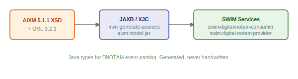

# aixm-model

Java bindings for the [AIXM 5.1.1](https://aixm.aero/) (Aeronautical Information Exchange Model) and [GML 3.2.1](https://www.ogc.org/standard/gml/) schemas, generated from XSD using JAXB.

This module exists because working with AIXM in Java requires a large set of generated classes that are tedious to produce and easy to get wrong. The XSD schemas, the JAXB binding customizations, and the generation process are packaged here so that downstream projects can use AIXM types as a Maven dependency without dealing with schema compilation themselves.



## What's inside

- **77 XSD schemas**, the official AIXM 5.1.1 distribution, GML 3.2.1, XLink, and a wrapper schema that ties them together
- **4 JAXB binding files** (`*.xjb`), customizations for AIXM, GML, XLink, and ISO GMD to resolve naming conflicts and produce clean Java packages
- **~1900 generated Java classes**, committed to the repository so that consumers don't need XJC tooling at build time
- **`AixmUnmarshallerPool`**, a thread-safe unmarshaller pool with XSD validation, secure XML parsing (XXE protection), and classpath-based schema resolution

## Generated packages

| Java package | Source schema |
|-------------|--------------|
| `aero.aixm.*` | AIXM 5.1.1 features, messages, events |
| `net.opengis.gml.*` | GML 3.2.1 geometry, coordinates, references |
| `org.w3.*` | XLink attributes |

## Technology

| Component | Version |
|-----------|---------|
| AIXM | 5.1.1 |
| GML | 3.2.1 |
| Jakarta XML Binding (JAXB) | 4.0.5 |
| JAXB Runtime (GlassFish) | 4.0.7 |
| Java | 21 |

---

## GET STARTED

### Prerequisites

- Java 21
- Maven 3.9+

### Install into local Maven cache

```bash
./mvnw clean install -DskipTests
```

This compiles the module and installs it into `~/.m2` so that downstream projects can resolve it.

### Add to your project

```xml
<dependency>
    <groupId>com.github.swim-developer</groupId>
    <artifactId>aixm-model</artifactId>
    <version>1.0.0-SNAPSHOT</version>
</dependency>
```

### Unmarshal AIXM messages

```java
// Thread-safe, create once and share across the application
var pool = new AixmUnmarshallerPool();

// Validates against XSD before returning; throws on invalid XML
AIXMBasicMessageType message = pool.unmarshalAndValidate(xmlString);

// Iterate over AIXM features in the message
for (var member : message.getHasMember()) {
    if (member.getAbstractAIXMFeature() != null) {
        var feature = member.getAbstractAIXMFeature().getValue();
        // handle RunwayType, AirportHeliportType, etc.
    }
}
```

---

## Regenerating the classes

The generated classes are committed to the repository. Regeneration is only needed if the XSD schemas or binding files change.

```bash
./mvnw process-sources -Pgenerate-xjc
```

This runs XJC against the wrapper schema, applies the binding customizations, and copies the generated classes into `src/main/java/`.

Running only `generate-sources` will delete the existing classes and not copy the new ones back. Always use `process-sources` or later.

---

## License

Licensed under the [Apache License 2.0](LICENSE).
